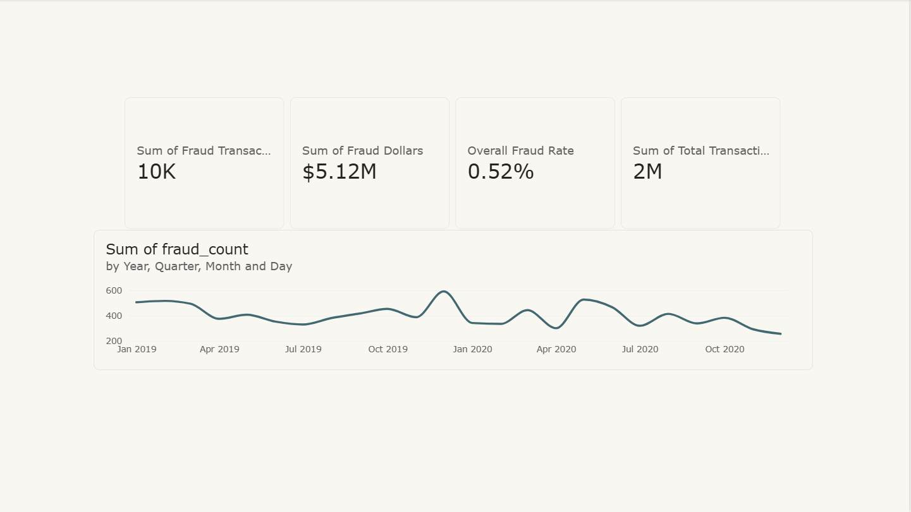
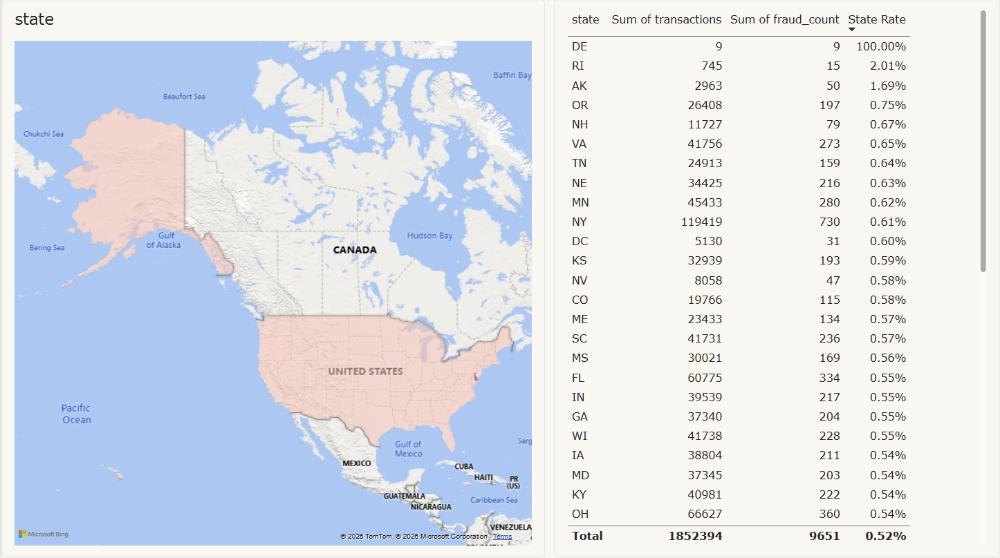
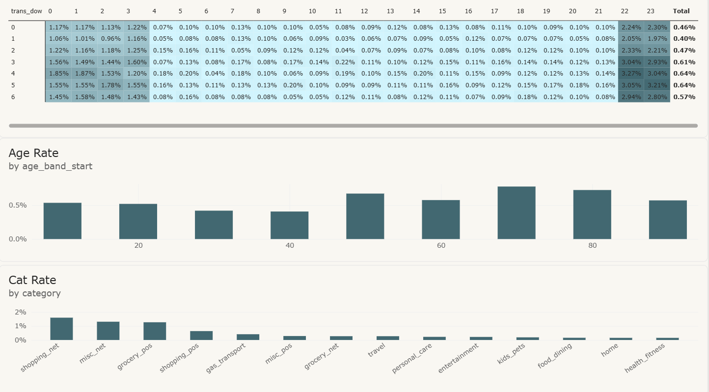

# Fraud Analytics

Detecting fraudulent card transactions in **1.85 million** records — SQL,
Python, and Power BI, end to end.

Built on the Sparkov simulated credit-card dataset (2019–2020, labeled
`is_fraud`). Simulated data, real methods: the patterns are lifelike, the
people are not.

## Findings

1. **Fraud is a needle-in-a-haystack problem.** 9,651 of 1,852,394
   transactions (0.52%) are fraudulent — so a model that never flags anything
   is 99.5% "accurate" while catching zero fraud. Accuracy is the wrong lens;
   precision/recall is the honest one.
2. **Fraud has a schedule and a wallet.** Night transactions (22:00–03:59)
   carry a **16.7× higher** fraud rate than daytime. Online shopping is the
   riskiest category, and the median fraudulent charge (**$390**) is 8× the
   median legitimate one ($48).
3. **The distance feature was a null result.** Customer-to-merchant distance
   was hypothesized as the star signal (stolen cards used far from home). The
   data said no — median distance is ~78 km for fraud and legit alike. Tested,
   rejected, and documented rather than hidden.
4. **XGBoost decisively beats the linear baseline on future data:** PR-AUC
   **0.881** vs 0.120, trained on 2019–mid-2020 and tested on the unseen
   second half of 2020. At an 80%-precision operating point it **catches 81%
   of all fraud while false-alarming only 7.8 per 10,000 legitimate
   transactions.**

## Dashboard (Power BI)

**Overview** — volume, fraud dollars, and the two-year fraud timeline:



**Geography** — fraud rate by state, with the ranking that explains the map
(Delaware: 9 transactions, all fraudulent — a small-sample outlier, which is
exactly why rate and volume are shown side by side):



**Patterns** — the night-fraud heatmap (day of week × hour), plus category
and age-band risk:



The report itself is committed at [`dashboard/FraudE.pbix`](dashboard/FraudE.pbix)
(built from the aggregate extract, so the file is ~100 KB); the build guide is
[`dashboard/README.md`](dashboard/README.md).

## Architecture

```
CSV (1.85M rows) -> PostgreSQL (load + clean) -> Python notebook (EDA, features, model) -> Power BI
```

| Piece | What it does |
|---|---|
| [`sql/01_schema.sql`](sql/01_schema.sql) | Raw landing table — slim by design (zero-signal columns dropped at load) |
| [`load_data.py`](load_data.py) | Chunked loader: both CSVs → PostgreSQL via bulk `COPY`, with a rerun guard |
| [`sql/02_clean.sql`](sql/02_clean.sql) | The clean layer as a view (derived hour/day/age columns) + lean indexes |
| [`notebooks/analysis.ipynb`](notebooks/analysis.ipynb) | The full analysis: EDA → distance feature → models → honest evaluation |
| [`make_dashboard_extract.py`](make_dashboard_extract.py) | Pre-aggregated workbook so the dashboard can build without a live DB connection |
| [`dashboard/`](dashboard/) | Power BI report, build guide, and page screenshots |

## Engineering notes (the honest section)

- **Why 1.85M rows live in PostgreSQL:** Excel's hard ceiling is 1,048,576
  rows — this dataset physically cannot open in it. Cleaning happened in SQL
  because that is where cleaning belongs at this scale.
- **Free-tier constraints shaped the design** (~1GB disk): the clean layer is
  a **view** (computed on read, zero storage), indexes are deliberately
  minimal (timestamp + a partial index on the 0.5% fraud rows), and the raw
  table stores only columns that earn their bytes. Constraints are design
  inputs, not excuses.
- **Evaluation is time-based** (train on the past, test on the future). A
  random split leaks future patterns into training and flatters every metric.
- **Simulated data disclosure:** transactions are generated by the Sparkov
  simulator. Patterns (night fraud, category risk) are realistic; no real
  cardholders exist in this data.

## Reproduce it

```bash
git clone https://github.com/SomaiUmair/fraud-analytics.git
cd fraud-analytics
pip install -r requirements.txt

# 1. Get the data (too large for GitHub): download the Sparkov fraud dataset
#    from Kaggle and place fraudTrain.csv + fraudTest.csv in data/
#    (a 1,000-row sample is committed at data/sample_1000.csv)

# 2. Point .env at a PostgreSQL instance (see .env.example), then:
python -c "import psycopg2, os; from dotenv import load_dotenv; load_dotenv(); \
  c = psycopg2.connect(os.getenv('DATABASE_URL')); c.cursor().execute(open('sql/01_schema.sql').read()); c.commit()"
python load_data.py                 # ~1.85M rows via bulk COPY
# then run sql/02_clean.sql, open the notebook, and/or build the dashboard
# from dashboard/README.md (Option B needs no database at all)
```
